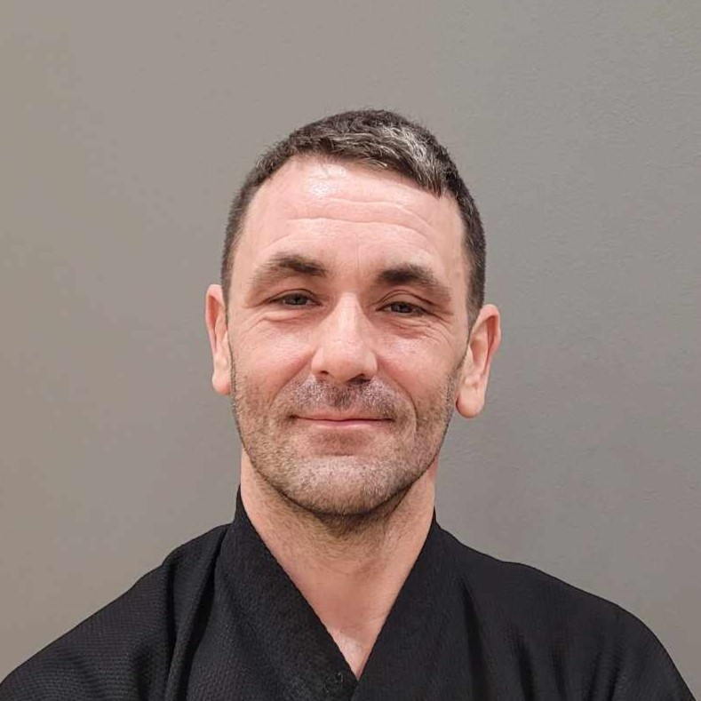
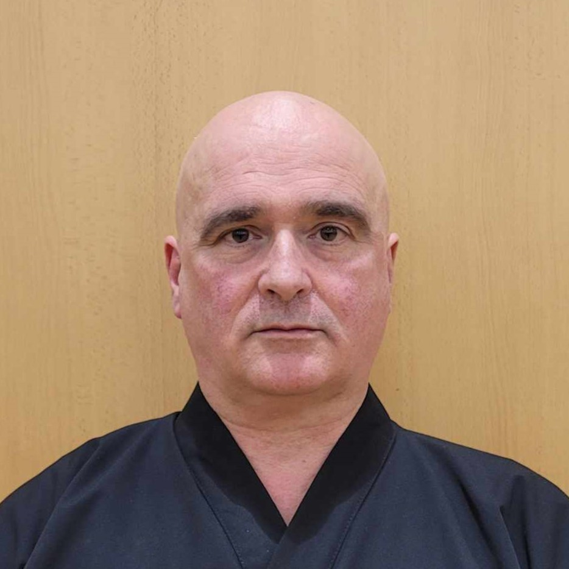
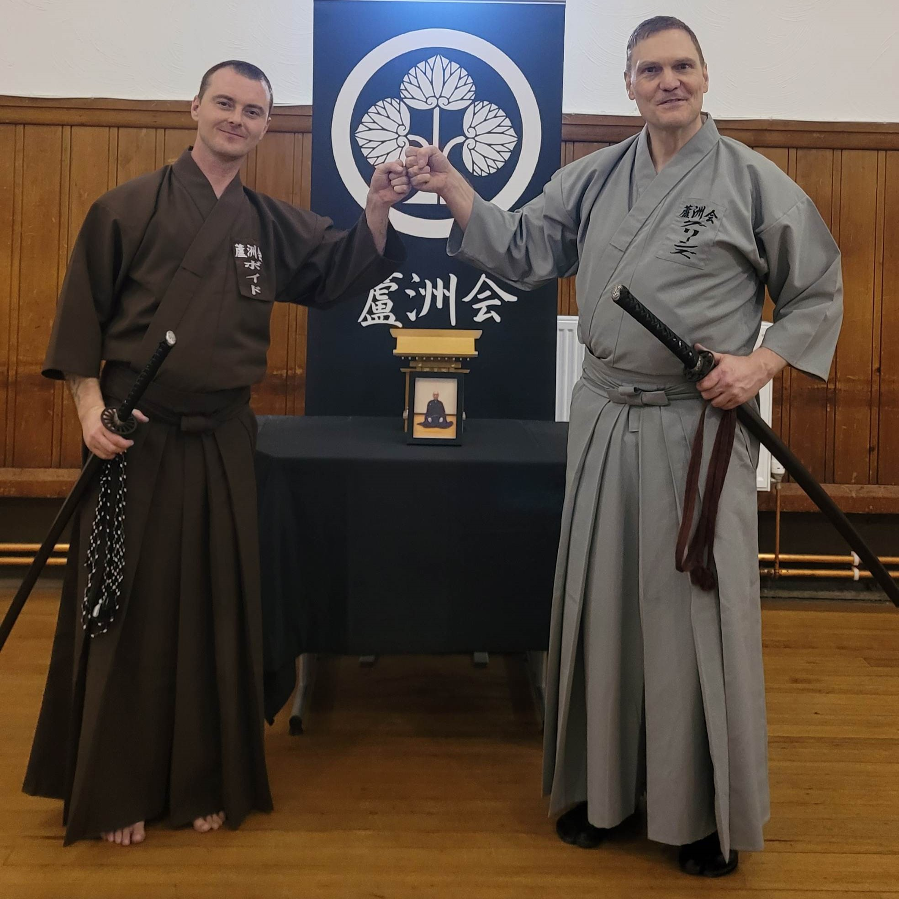
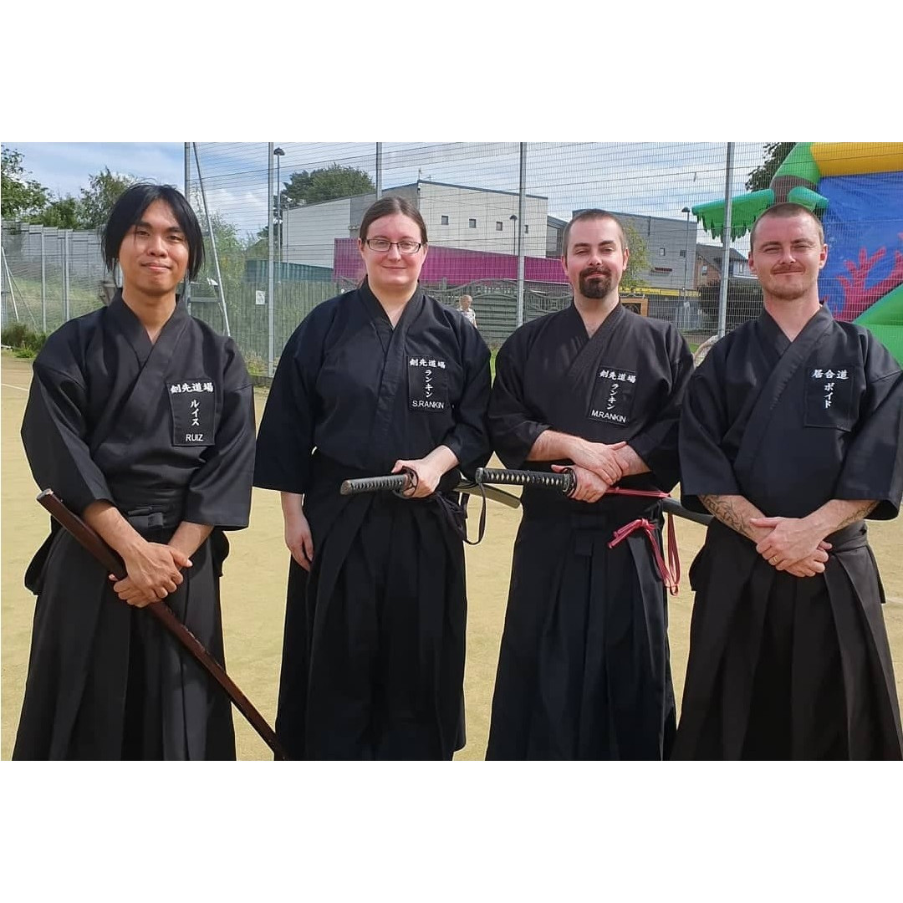

  

    
    
John Cockburn Senpai, 3rd Dan

  

  

    
    
Kenny Stewart Senpai, 3rd Dan

  

# Our Dojo

    

The Dojo was originally formed in 1973 by Sam McKay Sensei and as such is recognised as Scotland's oldest running Iaido Dojo. It has seen many Dojo leaders since its formation and is now managed by Robert Boyd, who took over the reins in 2017.

    

        
        
Honisz-Greens Sensei with Boyd Sensei  Edinburgh 2023 Koryu Koshukai

    

    

        
        
Open air practiice 2019

    

The Dojo has members coming from all walks of life and nationalities. Members have enjoyed great success in recent years at the UK National Championship and subsequently some members have gone on to represent their Dojo and country at the European Iaido Championship.