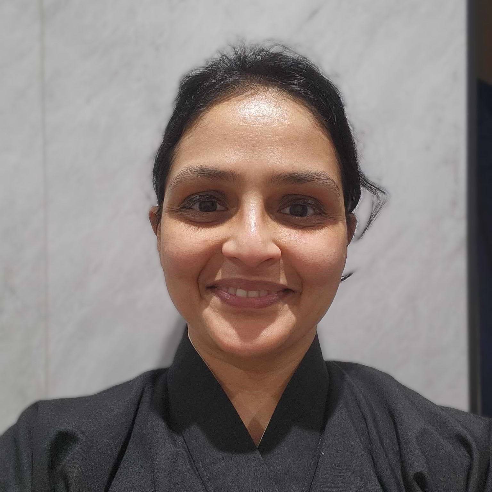
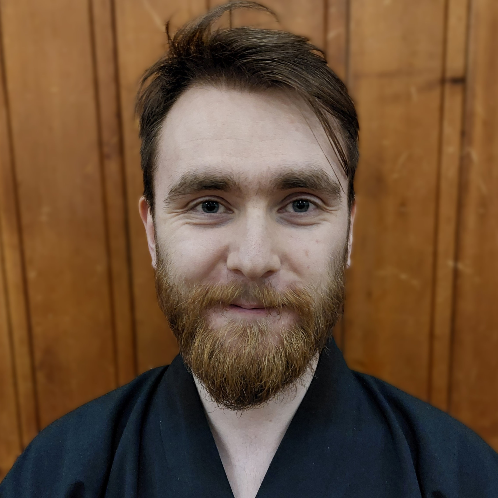
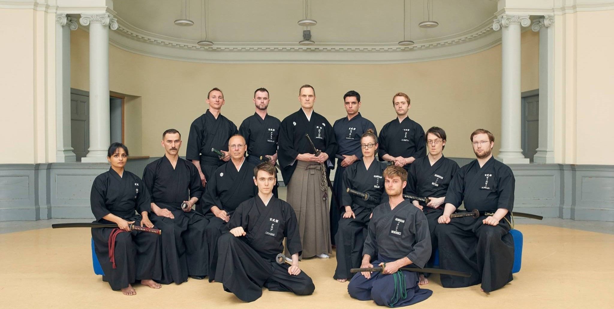
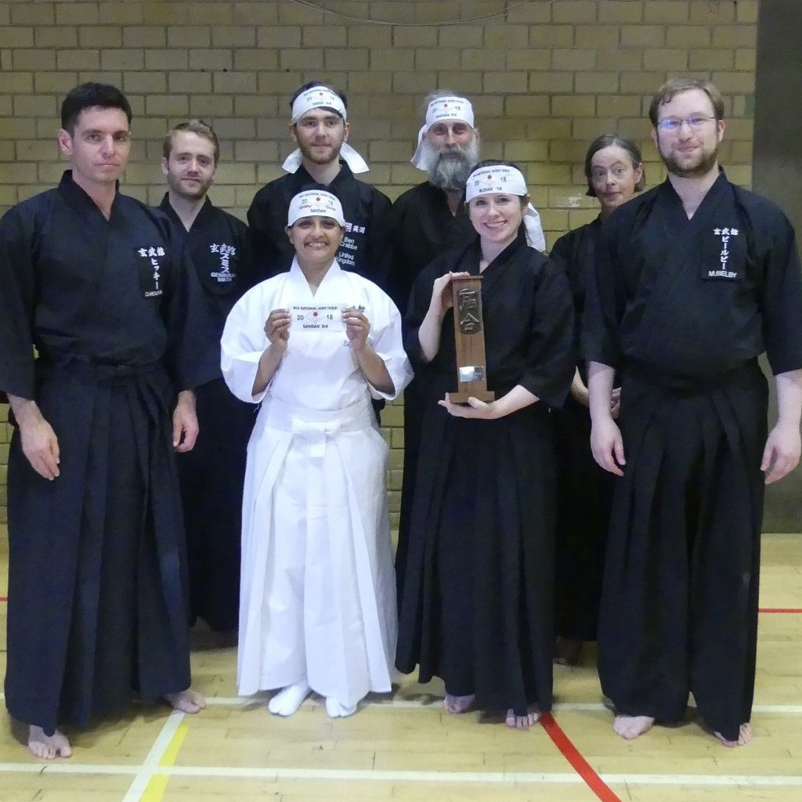
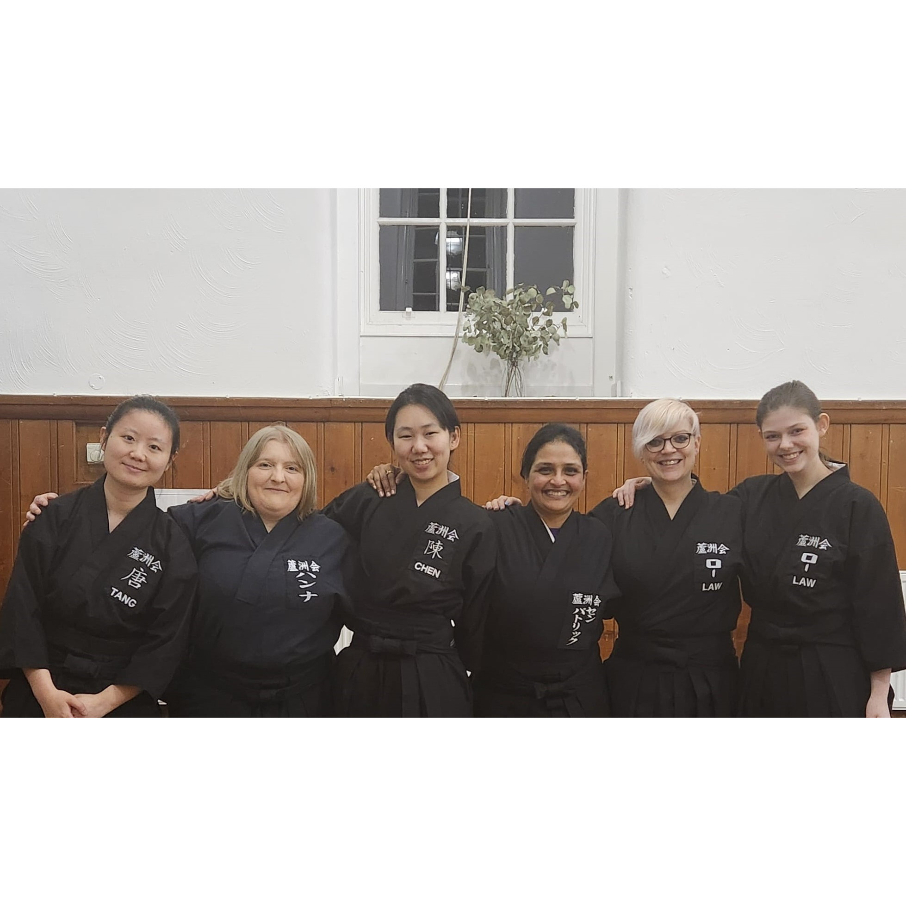

  

    
    
Shra Senpatrick Senpai, 4th Dan

  

  

    
    
Ben Crabbe Senpai, 4th Dan

  

# Our Dojo

  

There has been an Iaido presence in Edinburgh since around 1986. The Edinburgh Dojo was officially formed in late 2001 by David McLean Sensei, with oversight and support from John Honisz-Greens, who was still living in Japan at that time. Following Honisz-Greens Sensei's prolonged stay in Japan, McLean Sensei helped develop the club over the following 15 years, before moving full time to the Scottish Borders and opening up his own Dojo in the Borders. In 2022 the relationship between Honisz-Greens Sensei and David McLean Sensei was ended. 

    

        
        
BKA Nationals 2018

    

    

        
        
Women practitioners 2024

    

The Edinburgh club has a range of student abilities at all levels - from ungraded, first dan, all the way through to fifth dan. It’s a great club with good people and a welcoming atmosphere, in a truly superb location. The Dojo has members coming from all walks of life and nationalities, with members going on to represent their Dojo and country at the European Iaido Championship.