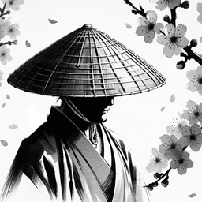

  

    
    
Scott Mandry, Senpai

  

# Our Dojo
Welcome to Dartford Dojo, a sanctuary of Iaido since the early 2005, where the art has been nurtured and cherished for decades. The Dojo's history is interleaved with that of Anna Stone Sensei: it is rich with tradition and the influence of esteemed patrons such as Fujii Okimitsu Sensei and Haruna Sensei. Their profound teachings have left an indelible mark on our community, guiding our practice and enriching our understanding of Iai.

In recent times, our affiliation with the Tokyo Adachi Roshukai, guided by the esteemed Honda Sensei, has introduced new dimensions to our practice, enhancing our collective journey with additional layers of depth and insight.
At Dartford Dojo, we celebrate the legacy of our past, the dedication of our present, and the promise of our future. We are a small and friendly Dojo and we welcome beginners at any time.