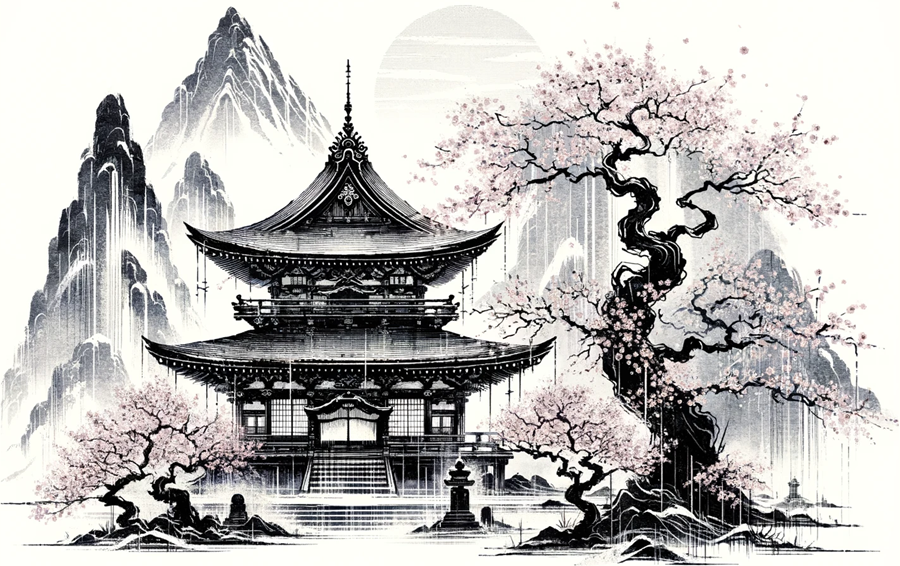
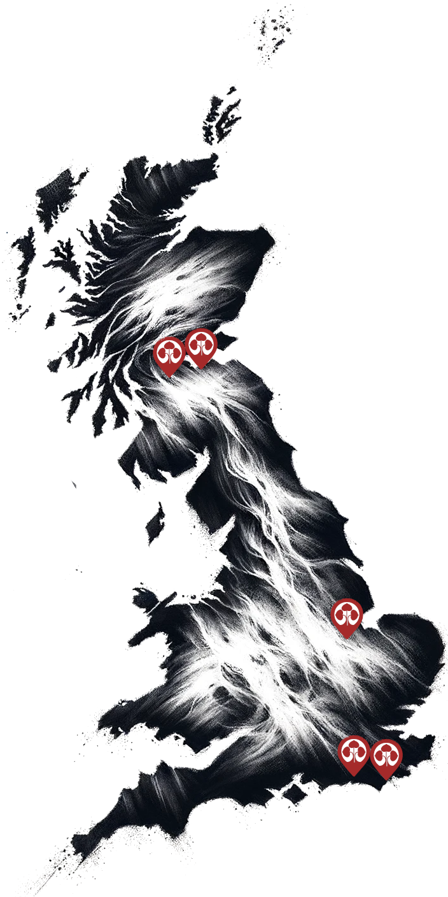
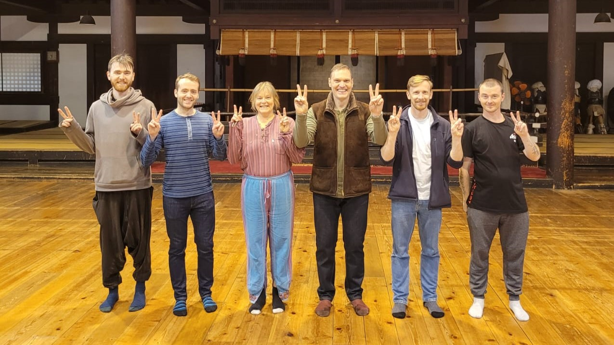
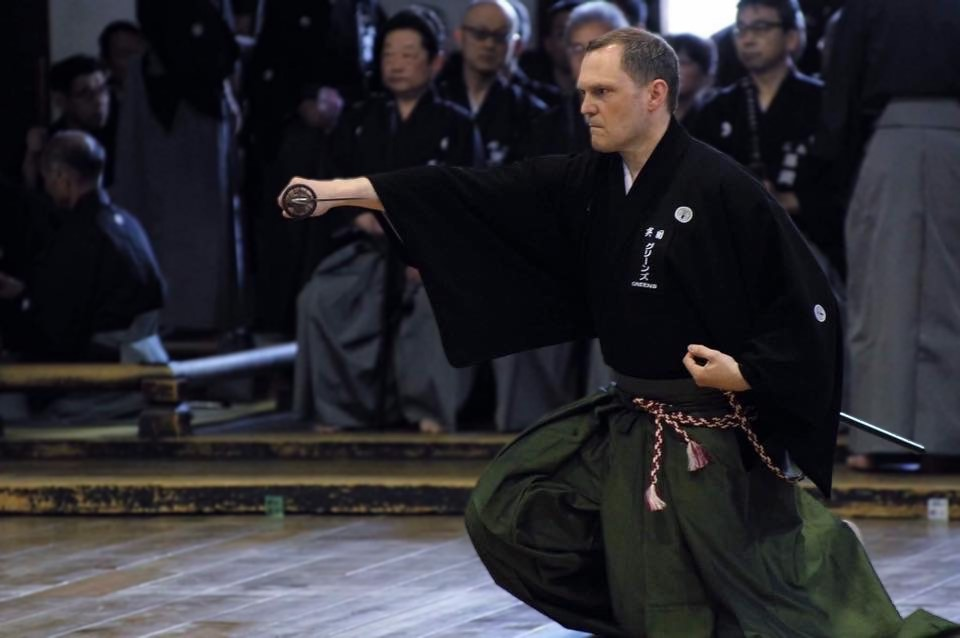
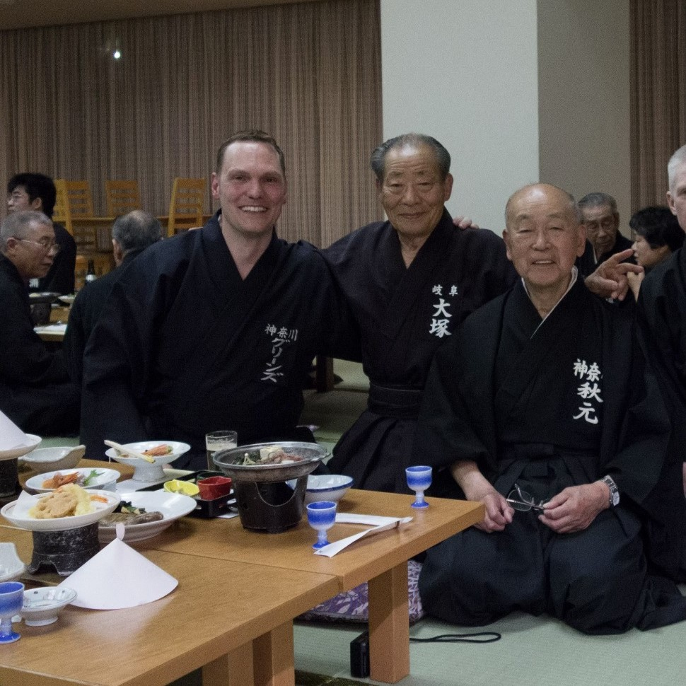
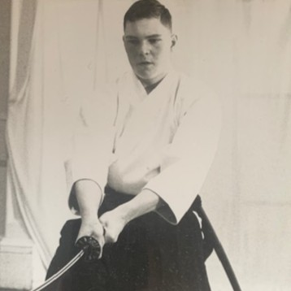
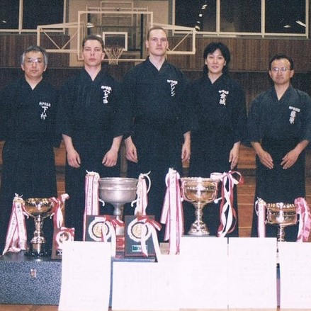

# Dojo

    

A Dojo (**道場**) is a dedicated space for the practice and teaching of martial arts, embodying the principles of discipline, respect, and continuous learning. It is not merely a physical training facility but a sacred environment where the philosophical and ethical aspects of martial arts are imparted alongside physical skills. The Dojo serves as a community hub where practitioners, from beginners to masters, engage deeply with their art, striving for personal growth and mastery. Central to its function is the cultivation of a respectful and focused atmosphere, ensuring that the legacy and teachings of the martial art are preserved and honoured.

Each Dojo is led by a Sensei (**先生**), who, as the chief instructor, imparts technical expertise alongside philosophical insights, shaping students into adept practitioners. Senpai (**先輩**), experienced students, offer guidance and support to kohai (**後輩**), juniors, embodying the Dojo's culture of mutual respect and continuous improvement. The hierarchy within the Dojo is to teach its members humility as well as trust. We expect our practitioners to adhere to this principle.

# Our Dojos
Beneath this text lies a curated map of our dojo locations. To discover tailored contact details, addresses, practice schedules, and more, kindly choose the dojo that aligns with your interest.

    

        
    

    

    
        

            <a href="{{ dojo.url }}">
                
                
{{ dojo.title }}

            </a>
        

    
    

Our Dojos are open to all members, offering flexibility to practise at any location. We come together as a group several times a year for seminars, both in-house and those organised by the British Kendo Association, to enhance our skills and foster community spirit. Our senior members regularly travel to Japan, deepening their understanding and mastery through training in the birthplace of Iaido.

    
    
Kyoto Budo Centre 2022

We warmly welcome new members to our friendly group. Whether you’re a beginner or experienced, you’ll find a supportive environment to learn and grow in the art of Iaido with us.

# Dojo-Cho
Dojo-Cho (**道場長**) is the esteemed leader and principal instructor of a martial arts Dojo, tasked with guiding the dojo's direction, teaching, and upholding its values and traditions. This role is pivotal in maintaining the integrity of the martial arts discipline, fostering a positive learning environment, and ensuring the transmission of knowledge to future generations. As the heart of the Dojo, the Dojo-Cho embodies the spirit and philosophy of the martial art, serving as a mentor and inspiration to all members.

    
    
John Honisz-Greens Sensei Kyoto Taikai 2017

Our Dojo-cho is John Honisz-Greens Sensei. His first Iaido teacher was Neil Kemp Sensei whom he met in 1986, in Edinburgh, when he was a teenager. That training continued until 1989 and stopped after Kemp Sensei relocated. During that time Honisz-Greens Sensei was also practicing Aikijutsu, and his passion for Aiki developed further when he met Gerd Kroell Sensei in 1990, and his subsequent membership of Tai Gyoku Ryu followed. Honisz-Greens Sensei studied for several years under Kroell Sensei, gaining the rank Joden Kyohan and building and developing a great friendship before heading to Japan in 1997. It was when he went to Japan that he restarted Iaido training at the Kobe Shiyakusho Iaido Dojo under the tutelage of Oshita Masakazu Sensei.

    

        
        
Celebrating with teachers

    

    

        
        
With Honda Sensei

    

Upon completing his initial university studies and with a job offer from a prestigious bank, Honisz-Greens Sensei negotiated to take a year out in 1997 to develop his Aikijutsu in Japan, He was employed by Hyogo Prefectural Government and based in Amagasaki City, between Osaka and Kobe. What followed was a career change and a prolonged stay of almost two decades in Japan. During this period Honisz-Greens Sensei was fortunate to meet many great teachers. One such teacher was Honda Masayoshi Jushin Sensei, the headteacher of Tokyo Adachi Roshukai.

Honisz-Greens Sensei has studied hard in Japan to develop his Iai, and despite his typically non-Japanese physiology has had some notable successes. As well as competing for both the Hyogo and Gifu prefectural teams whilst training in each prefecture, he won several individual and team taikai, and been placed in many others.

    

        
        
1987: In Kemp Sensei's dojo, Edinburgh

    

    

        
        
John Honisz-Greens after Taikai 2006: Nishi Nihon Taikai

    

Honisz-Greens Sensei passed his 6th Dan examination at first attempt in June 2012 in Kofu City, Yamanashi Prefecture - Japan. He was awarded his Renshi Shogo from the Zen Nihon Kendo Renmei in 2013. He is a British Kendo Association accredited Club Coach Level 2 and been awarded National Coach status and been a shinpan (judge) at the European Iaido Championships numerous times.