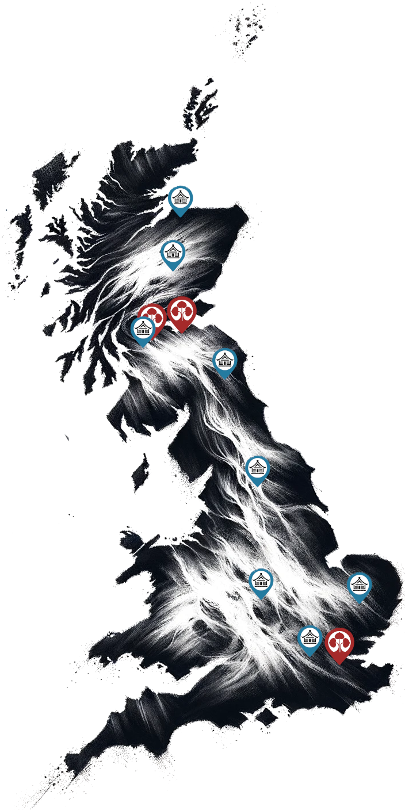

# Dojo

    

A Dojo (**道場**) is a dedicated space for the practice and teaching of martial arts, embodying the principles of discipline, respect, and continuous learning. It is not merely a physical training facility but a sacred environment where the philosophical and ethical aspects of martial arts are imparted alongside physical skills. The Dojo serves as a community hub where practitioners, from beginners to masters, engage deeply with their art, striving for personal growth and mastery. Central to its function is the cultivation of a respectful and focused atmosphere, ensuring that the legacy and teachings of the martial art are preserved and honoured.

Each Dojo is led by a Sensei (**先生**), who, as the chief instructor, imparts technical expertise alongside philosophical insights, shaping students into adept practitioners. Senpai (**先輩**), experienced students, offer guidance and support to kohai (**後輩**), juniors, embodying the Dojo's culture of mutual respect and continuous improvement. The hierarchy within the Dojo is to teach its members humility as well as trust. We expect our practitioners to adhere to this principle.

# Dojo Locations
Beneath this text lies a curated map of dojo locations. To discover contact details, addresses, practice schedules, and more, kindly choose the dojo that aligns with your interest.

    

        
        

            
            
            
        

    

    

        <h3 class="grid-dojos-header">Our Dojos</h3>
        

            
                

                    <a href="{{ dojo.url }}">
                        
                        
{{ dojo.title }}

                    </a>
                

            
        

        <h3 class="grid-dojos-header">Honourable Mentions</h3>
        

            
                

                    <a href="{{ dojo.url }}">
                        
                        
{{ dojo.location }}

                    </a>
                

            
        

    

Our Dojos are open to all members, offering flexibility to practise at any location. We come together as a group several times a year for seminars, both in-house and those organised by the British Kendo Association, to enhance our skills and foster community spirit. Our senior members regularly travel to Japan, deepening their understanding and mastery through training in the birthplace of Iaido.

We warmly welcome new members to our friendly group. Whether you’re a beginner or experienced, you’ll find a supportive environment to learn and grow in the art of Iaido with us.

### Reality check points for aspiring members

Iaido is a martial arts that require life-long dedication and commitment as at no point in your practice you will reach the end of what can be learned. It is a never receding journey of possibilities with no final lesson or destination.

Importantly, it is a matter of respect to the Sensei and your dojo colleagues, who will invest -
and gift their time and effort in teaching you, to dedicate yourself fully to the practice.

You are not "required" to show for every single practice day, as life sometimes gets in the way and we all have our personal and professional obligations to fulfil. 

However, regular attendance, as a minimum, is required. If you don't practice regularly, you will not progress. Non-diligence  disregards the gifts given to you.

Iaido is not a hobby that can be left and picked up when convenient and there is more at play than just you and your sword, you are part of something bigger. That seem strange to a beginner as only after time does one really begin to understand this point. 

While we practice the use of Japanese sword, this is not a "Samurai" training.

It is as much a practice and science of the sword as it is study of Budo principles and culture, fighting spirit, understanding the opponent, and hardest of all, understanding yourself and bettering yourself.

Sometimes the progress is slow and frustrating and it requires discipline, determination and willingness to change to overcome the stagnation. Iaido is an organic relationship as it is alive - it is you. But, persevarence always, without fail, bears results.

Some of us practice only Iaido solo forms, some like us also practice kumitachi (paired forms), which is an ideal combination as they complement each other. Others, for various reasons, practice only one or the other arts, which is also fine.

Iaido is suitable for both women and men. Age is not a barrier.

While it will probably take few life-times to learn everything there is to learn, this is not the ultimate goal. It is about your own personal development, about you bettering yourself.

In that light, any progress that you make is individual. If you make progress, no matter how small or big it is, it is valuable and will be at your own speed and in your own time. There is no pressure or rush to get to the next level.

Iaido does not require great physical strength or endurance to practice. But you will need to be reasonably agile and injury free.

**Important**: If you have any medical (present of past) conditions that may be exacerbated by physical exertion, please let the sensei and dojo know in advance. In rare cases, we may advise you to resolve them before taking up training. Good examples are tennis elbow, frozen shoulder, back or neck pain, tendons problems, problems with knees and similar.

Iaido will like any other important relationship challenge you. But the rewards, although often hard won, are extremely meaningful and valuable.

# Dojo-Cho
Dojo-Cho (**道場長**) is the esteemed leader and principal instructor of a martial arts Dojo, tasked with guiding the dojo's direction, teaching, and upholding its values and traditions. This role is pivotal in maintaining the integrity of the martial arts discipline, fostering a positive learning environment, and ensuring the transmission of knowledge to future generations. As the heart of the Dojo, the Dojo-Cho embodies the spirit and philosophy of the martial art, serving as a mentor and inspiration to all members.

    

        
        
John Honisz-Greens Sensei Kyoto Taikai 2017

    

    

        
        
2025: Nanadan shinsa, Prague

    

Our Dojo-cho is John Honisz-Greens Sensei. His first Iaido teacher was Neil Kemp Sensei whom he met in 1986, in Edinburgh, when he was a teenager. That training continued until 1989 and stopped after Kemp Sensei relocated. During that time Honisz-Greens Sensei was also practicing Aikijutsu, and his passion for Aiki developed further when he met Gerd Kroell Sensei in 1990, and his subsequent membership of Tai Gyoku Ryu followed. Honisz-Greens Sensei studied for several years under Kroell Sensei, gaining the rank Joden Kyohan and building and developing a great friendship before heading to Japan in 1997. It was when he went to Japan that he restarted Iaido training at the Kobe Shiyakusho Iaido Dojo under the tutelage of Oshita Masakazu Sensei.

    

        
        
Celebrating with Otsuka Hanshi and Akimoto Hanshi

    

    

        
        
With Honda Sensei

    

Upon completing his initial university studies and with a job offer from a prestigious bank, Honisz-Greens Sensei negotiated to take a year out in 1997 to develop his Aikijutsu in Japan, He was employed by Hyogo Prefectural Government and based in Amagasaki City, between Osaka and Kobe. What followed was a career change and a prolonged stay of almost two decades in Japan. During this period Honisz-Greens Sensei was fortunate to meet many great teachers. One such teacher was Honda Masayoshi Jushin Sensei, the headteacher of Tokyo Adachi Roshukai.

    

        
        
1988: In Kemp Sensei's dojo, Edinburgh

    

    

        
        
John Honisz-Greens after Taikai 2006: Nishi Nihon Taikai

    

Honisz-Greens Sensei passed all his Iaido grades in Japan and passed his 6th Dan examination at first attempt in Kofu City, Yamanashi Prefecture - Japan. He was also awarded his Renshi Shogo from the Zen Nihon Kendo Renmei. 

He passed 7th Dan in Prague in 2025.

He is a British Kendo Association accredited Club Coach Level 2 and been awarded National Coach status and been a shinpan (judge) at the European Iaido Championships numerous times.