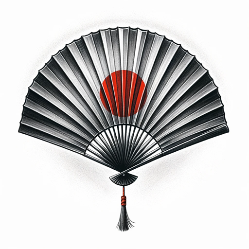

# About

    

Welcome to the homepage of the Tokyo Adachi Roshukai UK!

We are a non-profit making martial arts club established to help promote and practise the swordsmanship art of Iaido throughout the UK. For those interested in beginning their practice or for any other inquiries, please refer to our [Dojos](/dojos/index.html#our-dojos) tab for contact information and further details.

*Iaido* (**居合道**), pronounced ee-eye-doe and often abbreviated to Iai, is a traditional Japanese martial art that is often translated as 'the art of drawing the sword', or 'the way of mental presence and immediate reaction'. At its most basic interpretation, Iaido emphasises being aware and capable of quickly drawing the sword and responding to a sudden attack from multiple opponents; however, like most traditional Japanese art forms there are multiple layers of detail and study involved that go beyond the obvious forms being practised.

    
    
2023: Tokyo Adachi Roshukai seminar in Sussex

Iaido is practised through controlled precise movements and forms which are taught as individual techniques called kata. Although Iaido is generally practised as non-contact consisting of solo kata against imaginary opponents, there are also forms that require pair-work with bokuto (wooden swords), and  there are more advanced forms that involve grappling techniques.

At Tokyo Adachi Roshukai UK, we practise the Yamauchi-ha Iai of Muso Jikiden Eishin Ryu (**無雙直傳英信流**). However, our syllabus also includes the standardised set of twelve Iaido forms formulated by the All Japan Kendo Federation Zen Nippon Kendo Renmei (**全剣連 居合道**) that are taught within a number of Iaido/Kendo federations to teach and promote Iaido around the world. 

Please see the [Lineage](/lineage/index.html) page for more information on the Iai we study.

    <a href="https://www.britishkendoassociation.com/">
        
        
British Kendo Association

    </a>

Our dojos are aligned with the British Kendo Association (BKA), ensuring adherence to the official standards and safety measures for Iaido in the UK. We kindly encourage those interested in the disciplines of Kendo, Iaido, and Jodo to follow their page. There, you will find updates and insights that illuminate these traditional practises, fostering a community dedicated to the path of learning and refinement.