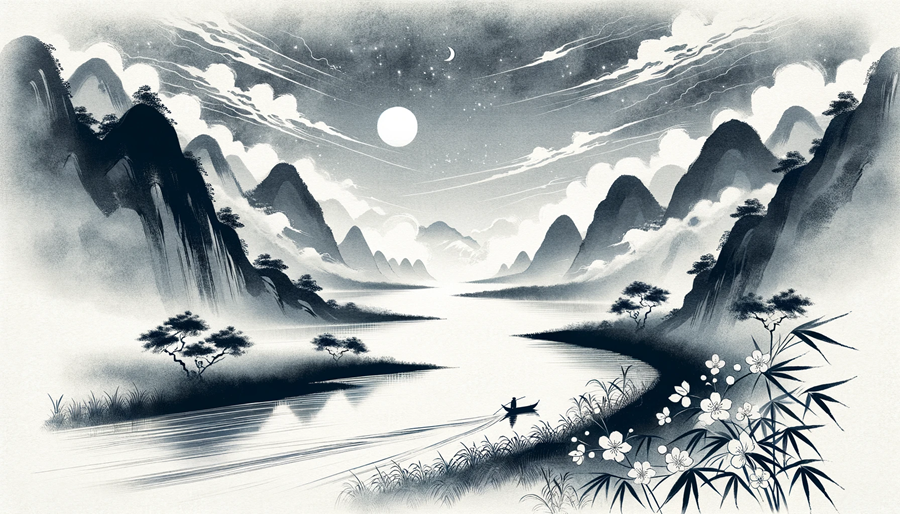
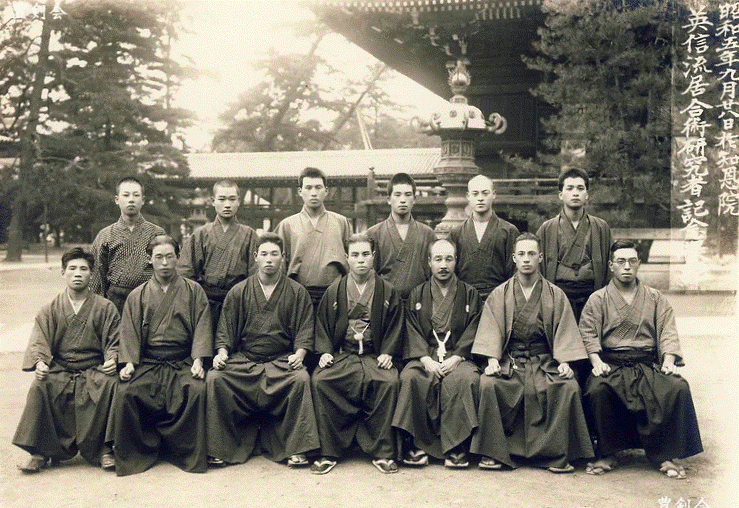
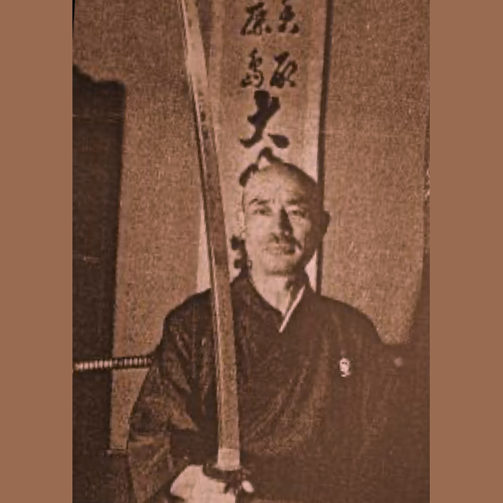
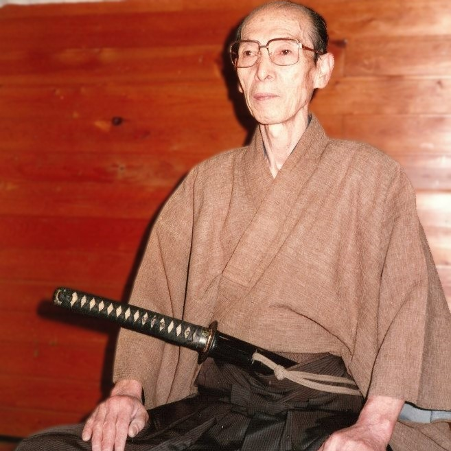
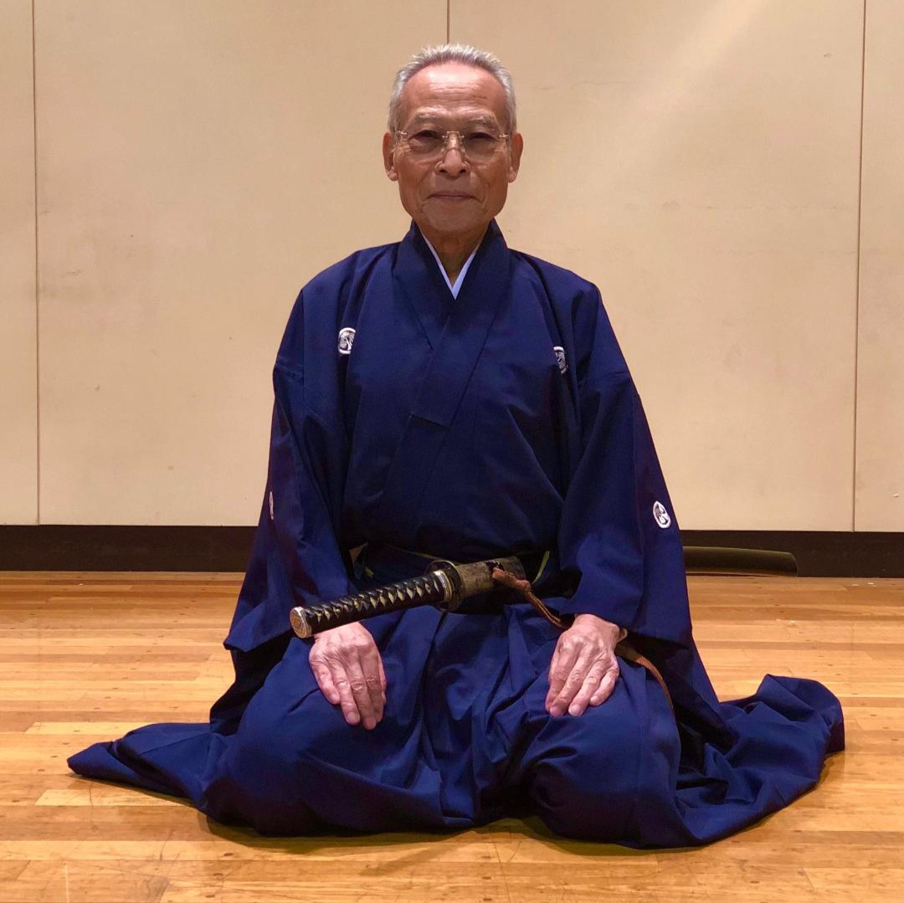
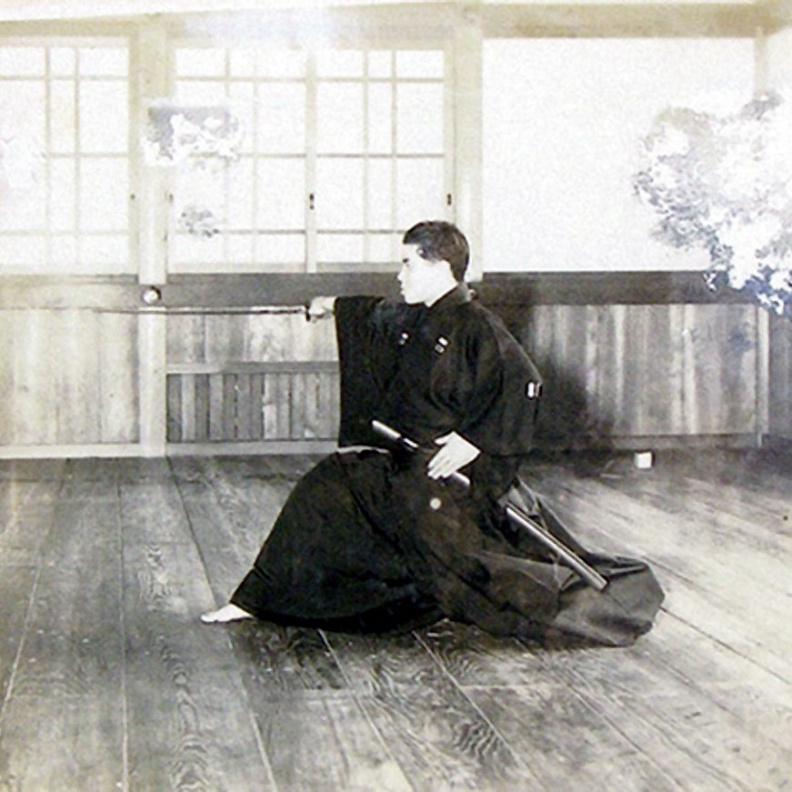
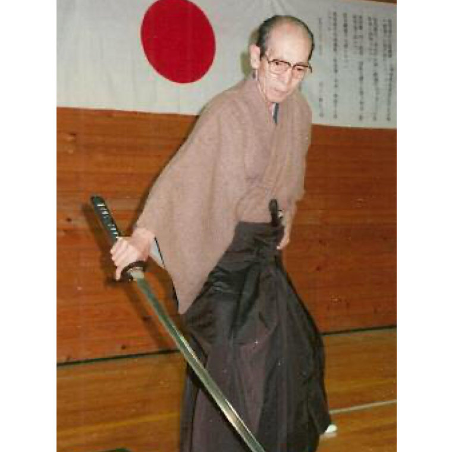
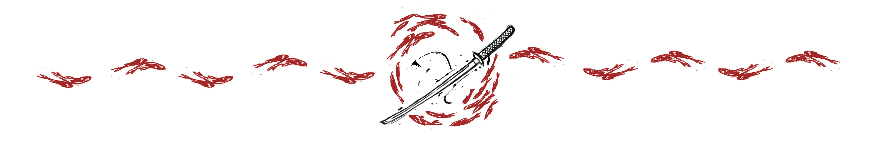

# Lineage

    

Lineage (**系図**) in martial arts traces the heritage and transmission of knowledge from one generation to the next. This unbroken chain of masters and students is central to the preservation and integrity of the martial tradition, ensuring that teachings remain pure and authentic over time. Understanding a martial art's lineage offers insight into distinct history, techniques, and philosophies.

Iaijutsu (**居合術**) is the art in which one draws the sword and strikes the opponent in one single movement with the Spirit (**精神**), the Body (**身体**), and the Sword (**剣**) as one. There are several styles of Iaijutsu that are still practised today. They are mainly the following:
* **英信流** - Eishin Ryu ("Eishin School")
* **長谷川流** - Hasegawa Ryu ("Hasegawa School")
* **長谷川英信流** - Hasegawa Eishin Ryu ("Hasegawa Eishin School")
* **無双直伝英信流** - Muso Jikiden Eishin Ryu ("Unparalleled Direct Transmission Eishin School")
* **伯耆流** - Hoki Ryu ("Hoki School")
* **大森流** - Omori Ryu ("Omori School")
* **関口流** - Sekiguchi Ryu ("Sekiguchi School")
* **新陰流** - Shinkage Ryu ("New Shadow School")
* **水鷗流** - Sui'o Ryu ("Water Gull School" or "Water Oyster Catcher School")
* **無外流** - Mugai Ryu ("Nothing Beyond School" or "No Nothingness School")
* **無双神伝流** - Muso Shinden Ryu ("Unparalleled Divine Transmission School")

The Tokyo Adachi Roshukai is a group dedicated to the study of Muso Jikiden Eishin Ryu (MJER) Iaijutsu of the Yamauchi Branch. 

# Our Lineage

Muso Jikiden Eishin Ryu originates from Tosa Province (modern day Kochi Prefecture), an extensive area of Japan which was ruled by the Yamauchi clan throughout the Edo Period. 

Yamanouchi Toyotake Sensei (1903 - 1946) held the title of Viscount and was a direct student of 17th generation Oe Masaji / Masamichi Sensei (1852 - 1927). He was one of a handful of 18th generation students to receive the Iaijutsu Kongen no Maki (**根源の巻**), a scroll signifying complete transmission of the school. 

    
    
Yamauchi Toyotake Hoken Sensei with students

Yamauchi Sensei had learned Yagyu Shinkage Ryu (**柳生新陰流** - "Yagyu New Shadow School") and because the Yamauchi family were the lords of Tosa region, he also learned the local art – what we commonly now refer to as Muso Jikiden Eishin Ryu. However, as the grandson of Daimyo Yamauchi Yodo, Oe Sensei’s former lord, he was taught Iai befitting a lord. While the core forms remain the same, this manifests through small stylistic differences from other branches of MJER. Yamauchi Toyotake Sensei published the 'Iai Shousetsu' formalising some of the knowledge of our school in writing for the first time publicly.

    

        
        
Kono Kanemitsu Sensei

    

    

        
        
Onoue Masamitsu Sensei

    

The 19th generation master Kono Kanemitsu Sensei was a student of Yamauchi Sensei founded the Meibukan Dojo in Toshima-ku, in Tokyo. 

The 20th generation master, Onoue Masamitsu Sensei, inherited the Meibukan Dojo.

The Tokyo Adachi Roshukai was formed and led by 21st generation master Honda Masayoshi Jushin Sensei (1936 – 2022) who was awarded Iaijutsu Kongen no Maki from his teacher Onoue Masamitsu Sensei also held the rank of Kyoshi 7dan from the ZNKR. Honda Sensei was also a student of Iwata Norikazu Sensei, the founder of the Roshukai.

    
    
Honda Masayoshi Jushin Sensei

Honda Masayoshi Jushin Sensei devoted himself to the practice of Iai for over 50 years and formed and led the Adachi Roshukai branch for over three decades. His strength of character and passion for Iai was an inspiration for many students both in Japan and around the world. 

Honda Sensei was posthumously awarded a Kensho-jo (**顕彰状**, official commendation) from the ZNKR in 2023 for his contribution to the federation and development of Iai.

    <a href="https://ja.wikipedia.org/wiki/%E6%9C%AC%E5%A4%9A%E6%B0%8F">
        
        
Honda family

    </a>

The Tokyo Adachi Roshukai UK is honored to use the Honda family crest (Honda-shi), acknowledging our deep connection to our Japanese origins, also signifying the trust and friendship established between Honda Masayoshi Jushin Sensei and our Dojo-cho.

# Syllabus
### Shoden

    

        
        
Yamauchi Toyotake Hoken Sensei

    

    

        
        
Onoue Masamitsu Sensei

    

In the spirit of Iaido, below is a glimpse into some of the Shoden (**初伝**) - or foundational entry level kata that shape our TAR syllabus. These forms serve as an introduction to the deeper, silent teachings that underpin our lineage’s rich history. These Shoden forms alone are enough to keep even the most avid practitioner busy for a lifetime, if not two lifetimes. Once a clear understanding and skill is developed, the student is then permitted to learn and practice deeper level Shoden forms and also introduced into the next higher forms.

| No. |       |     Name          |                |
|-----|--------------------------|------------------|
| 1   | **前** | Mae             | *Front*          |
| 2   | **後ろ** | Ushiro        | *Behind*         |
| 3   | **右** | Migi            | *Right*          |
| 4   | **左** | Hidari          | *Left*           |
| 5   | **八重垣** | Yaegaki     | *Multifold Fences* |
| 6   | **受け流し** | Uke-nagaeshi| *Flowing Block* |
| 7   | **-** | -      | *-* |
| 8   | **突込** | Tsuke-komi     | *Pursuit*         |
| 9   | **月影** | Tsuki-kage     | *Moonbeams*    |
| 10  | **追風** | Oi-kaze        | *Tailwind*  |
| 11  | **陰陽進退** | Inyo-shintai | *Yin and Yang Advance and Retreat* |
| 12  | **抜き打ち** | Nuki-uchi  | *Sudden Draw*    |

    

### Kumitachi
Kumitachi (**組太刀**) refers to pre-arranged sparring forms or sequences practised with bokken **木剣** (wooden swords) in Japanese martial arts, particularly in disciplines such as Iaido, Kenjutsu, and Kendo. These forms are designed to teach practitioners the principles of timing, distance, and technique in a combat situation, simulating real sword fights to enhance understanding and application of martial arts concepts.

| No. |      |     Name             |                                |
|-----|---------------------------------|-------------------------------------------|
| 1   | **出会い** | De-ai              | *Meeting*                                 |
| 2   | **拳取り** | Kobushi-dori       | *Fist Grab*                               |
| 3   | **絶妙剣** | Zetsu-myo-ken      | *Exquisite Sword*                         |
| 4   | **独妙剣** | Doku-myo-ken       | *Unique Sword*                            |
| 5   | **鍔留め** | Tsuba-dome         | *Tsuba Stop*                              |
| 6   | **受け流し** | Uke-nagaeshi     | *Receiving and Reversing*                 |
| 7   | **万法** | Mappo                | *Complete Method*  |

    

### Zen Nippon Kendo Renmei

The All Japan Kendo Federation (ZNKR) Iaido forms, as presented in this table, encompass a standardized set of techniques designed to cultivate precision, awareness, and harmony in the practice of Iaido.

| No. |     |           Name |                   | School                                      |
|-----|--------------------------------------------|---------------------------------------------|
| 1   | **前** | Mae | *Front*                | Muso Jikiden Eishin Ryu |
| 2   | **後ろ** | Ushiro | *Behind*           | Muso Jikiden Eishin Ryu |
| 3   | **受け流し** | Uke-nagaeshi | *Receiving Deflection* | Muso Jikiden Eishin Ryu |
| 4   | **柄当て** | Tsuka-ate | *Hilt Strike* | Hoki Ryu |
| 5   | **袈裟切り** | Kesa-giri | *Diagonal Cut* | Hoki Ryu |
| 6   | **諸手突き** | Morote-tsuki | *Two-handed Thrust* |  Muso Jikiden Eishin Ryu |
| 7   | **三方切り** | Sampo-giri | *Three-direction Cut* | All Japan Kendo Federation |
| 8   | **顔面当て** | Ganmen-ate | *Face Strike* | Muso Jikiden Eishin Ryu |
| 9   | **添え手突き** | Soete-zuki | *Assisted Hand Thrust* | Hoki Ryu |
| 10  | **四方切り** | Shiho-giri | *Four-direction Cut* | Hoki Ryu |
| 11  | **総切り** | Sou-giri | *Total Cut* | Muso Jikiden Eishin Ryu |
| 12  | **抜き打ち** | Nuki-uchi | *Drawing Cut*  | Mugai Ryu |

ZNKR Iaido forms are used as a worldwide yardstick for grading and competition purposes for associations and individual groups/Dojo aligned to the International Kendo Federation (FIK). These forms are also studied and developed throughout the TAR student's lifetime of study.